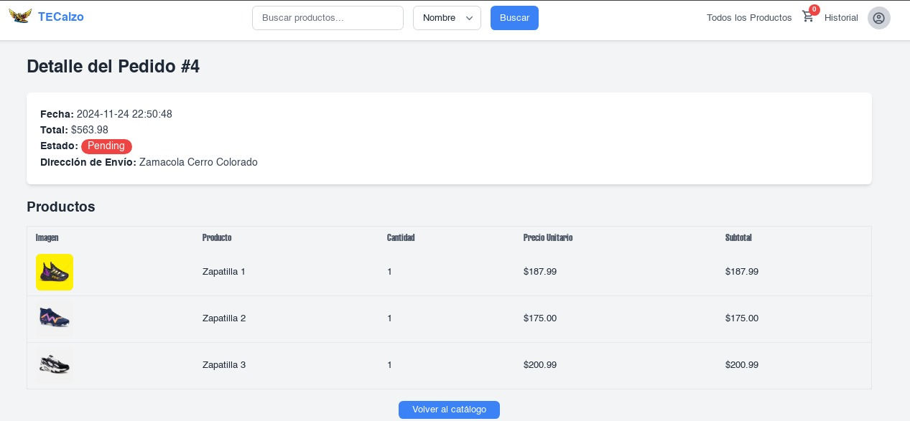

# TECalzo

## Descripción General

Tienda online de calzado desarrollada en Laravel. Permite explorar productos, filtrarlos, gestionar un carrito, realizar pedidos y consultar historial. Incluye panel de administración para productos y órdenes.

## Características Principales

- Página de inicio atractiva y funcional.
- Catálogo de productos con imágenes y descripciones.
- Filtrado de productos por género (mujer) y por rango de precio.
- Carrito de compras con gestión de productos seleccionados.
- Proceso de pedido sencillo y seguro.
- Historial de pedidos para usuarios registrados.
- Panel de administración para gestión de productos y órdenes.

---

## Tecnologías Usadas

- **Backend:** Laravel (PHP)
- **Frontend:** Blade, Tailwind CSS
- **Base de datos:** MySQL
- **Autenticación:** Laravel Breeze
- **Otros:** Vite, Composer, NPM

---

## Features y Vistas

### 1. Inicio

Vista principal con acceso rápido al catálogo y promociones destacadas.

---

### 2. Catálogo de Productos

Listado de todos los productos disponibles, con imágenes y detalles.

---

### 3. Filtrado por Mujer

Permite mostrar solo productos para mujer.

---

### 4. Filtrado por Precio

Permite ordenar o filtrar productos según el rango de precios.

---

### 5. Carrito de Compras

Gestión de productos seleccionados antes de realizar el pedido.

---

### 6. Pedido

resumen.

---

### 7. Historial de Pedidos

Consulta de pedidos realizados por el usuario.

---

### 8. Admin - Lista de Productos

Panel para que el administrador gestione el catálogo.

---

### 9. Admin - Órdenes

Panel para que el administrador gestione los pedidos recibidos.

## Informe y documentación

- [Informe técnico del proyecto](https://drive.google.com/file/d/1rZBAh0MkS2pT_epAtYX6AH9jNwbFsls1/view?usp=drive_link)
- [Presentación final (PDF)](https://drive.google.com/file/d/1Ofu3pGrbisTsS5uMShXgAm7E3QaZdSWN/view?usp=drive_link)

---

## Autor

**Italo H.**  
[LinkedIn](https://linkedin.com/in/italo-huillca) · [Correo](mailto:huillca.italo@gmail.com)
